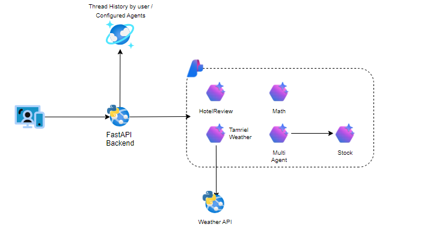

# Introduction

🚀 **Welcome to the Azure AI Agents Demo Repository!** 🌟

This repository showcases a demo implementation of the **Azure AI Agent Service** with multiple agents configured using a **GitOps-inspired approach** for deployment. 🛠️ It includes:

- Python scripts for all agents 🤖
- A **FastAPI backend** leveraging the **Azure AI Foundry SDK** ⚡

Explore, learn, and innovate with this cutting-edge integration of Azure AI services! 💡

## GitOps-Inspired Implementation

🔧 **GitOps-Inspired Configuration with Azure AI Agents** 🌐

In this demo, we implemented a configuration approach that avoids reliance on Bicep or Terraform due to their unavailability. Instead, agents are configured using a **GitOps-inspired approach** where configurations are stored in version-controlled repositories. The **Azure SDK for Python** is utilized to dynamically retrieve and deploy these configurations. This method aligns more closely with DevOps practices, ensuring seamless integration and deployment of agents.

For detailed instructions and code examples, check out the [GitOps documentation](GITOPS.md). 📖✨

## Architecture

## AgentAPI

### Leveraging Azure AI Project SDK in FastAPI Backend

🌟 **FastAPI Backend with Azure AI Project SDK** 🚀

The **FastAPI backend** serves as the REST API layer, wrapping the **Azure AI Project SDK** to provide seamless interaction with the AgentSDK. This backend acts as the gateway for customers to interact with the configured agents, enabling dynamic and scalable AI-powered solutions.

Key features include:

- **RESTful API endpoints** for managing and interacting with agents 🔄
- Integration with the **Azure AI Project SDK** for streamlined operations ⚙️
- A user-friendly interface for customers to interact with AI agents 🤝

This design ensures a robust and efficient system for deploying and managing Azure AI agents while maintaining simplicity and scalability. 🌐✨

##

## REST API Documentation

📄 **Detailed REST API Information** 🔍

For comprehensive details about the REST API endpoints, their usage, and examples, refer to the [REST API documentation](RESTAPI.md). 📘✨