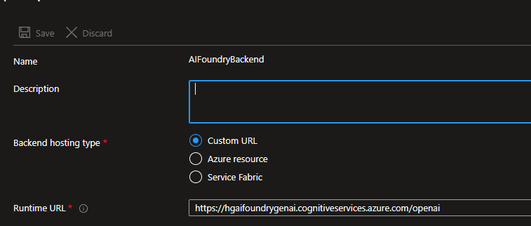
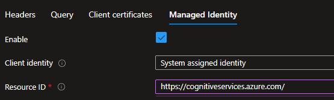
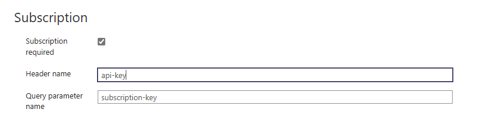

# How to setup

First you need to import the openapi.yml specification creating a new api in Azure API Management.

I recommend using the native connector from APIM this is the easiest way and save it n your git.

In this Github repo we have the specification for OpenAI version **2024-02-01**.  You can find the spec at his [link](https://learn.microsoft.com/en-us/azure/ai-services/openai/reference#completions)

Some newer version come with more operations, so be sure to remove what you don't want to expose.  

Alternativaley you could just use the link above and get the specific spec you needs this give you full control.

The default URL in this specification is **https://contoso/foundry/openai**.  Contoso should be the exact path of your endpoint of Azure OpenAI Service.

Here some example of endpoint

| Services | Endpoint | Example in APIM |
|----------|----------|-----------------|
| Azure AI Foundry inference endpoint | https://contoso.cognitiveservices.azure.com/ | https://contoso.cognitiveservices.azure.com/foundry/openai |
| Azure AI Foundry OpenAI endpoint | https://contoso.cognitiveservices.azure.com/ | https://contoso.openai.azure.com/foundry/openai |
| Open AI Resource without Foundry | https://openai-tozskk2f6pxbs.openai.azure.com/ | https://openai-tozskk2f6pxbs.openai.azure.com/foundry/openai |

What is important here is the prefix in this case **foundry** and add openai at the end for SDK compability like the one of OpenAI add this automatically.

# Create the backend service in APIM

Create a backend in the APIM related to the endpoint you need to configure like the image below

Is important to add in the runtime URL at the end openai.

If not this won't work, it's for SDK compabitility since OpenAI SDK and other add this when they call the endpoint

Next you will want to leverage the managed identity of APIM to call the Azure OpenAI instance.  Take a look at the resource ID this is important.  You tried to avoid to use the API Key for security purpose

Another important thing to modify to be compatible with the SDK is to change the subscription key in APIM header to api-key.

# More policy and tutorial

https://github.com/Azure-Samples/AI-Gateway/tree/main/labs